## 📋 Sobre o Projeto 

Este projeto foi desenvolvido a partir de um site simples criado por uma familiar como teste para uma loja de uniformes. O objetivo do site era simular a venda de camisetas, permitindo que o usuário selecionasse tamanho e quantidade, adicionasse ao carrinho temporário e finalizasse o pedido via WhatsApp.

A aplicação foi construída em **HTML puro** com alguns arquivos em **JavaScript**, sem integração com banco de dados, meios de pagamento ou persistência de carrinho. O carrinho é apenas temporário e o fluxo de compra redireciona diretamente para o WhatsApp com as informações do pedido.

Aproveitei essa oportunidade para:

- Praticar análise de requisitos  
- Elaborar casos de teste manuais  
- Criar cenários BDD  
- Validar fluxo de compra  
- Testar regras de seleção de tamanho e quantidade  
- Identificar possíveis melhorias  

Este projeto foi desenvolvido a partir de um site simples criado por uma familiar como teste para uma loja de uniformes. O objetivo do site era simular a venda de uniformes, permitindo que o usuário selecionasse tamanho e quantidade, adicionasse ao carrinho temporário e finalizasse o pedido via WhatsApp.

A aplicação foi construída em **HTML puro** com alguns arquivos em **JavaScript**, sem integração com banco de dados, meios de pagamento ou persistência de carrinho. O carrinho é apenas temporário e o fluxo de compra redireciona diretamente para o WhatsApp com as informações do pedido.

Aproveitei essa oportunidade para:

- Praticar análise de requisitos  
- Elaborar casos de teste manuais  
- Validar fluxo de compra  
- Testar regras de seleção de tamanho e quantidade  
- Identificar possíveis melhorias

  
<table>
  <tr>
   <td>ID:
   </td>
   <td>1
   </td>
  </tr>
  <tr>
   <td>Título:
   </td>
   <td>Validar inserção de quantidade válida no carrinho
   </td>
  </tr>
  <tr>
   <td>Pré Condição:
   </td>
   <td>O usuário deve estar na página de detalhes do produto.
   </td>
  </tr>
  <tr>
   <td>Passos:
   </td>
   <td>
<ol>

<li>Acessar a Loja</li>

<li>Selecionar um produto</li>

<li>Selecionar um tamanho válido</li>

<li>Inserir "2" no campo quantidade</li>

<li>Clicar em "Adicionar ao carrinho"</li>
</ol>
   </td>
  </tr>
  <tr>
   <td>Resultado Esperado:
   </td>
   <td>O sistema deve adicionar o produto ao carrinho com a quantidade informada e exibir o valor corretamente.
   </td>
  </tr>
  <tr>
   <td>Resultado Obtido:
   </td>
   <td>O sistema adiciona o produto ao carrinho com a quantidade correta e exibe as informações corretamente.
   </td>
  </tr>
  <tr>
   <td>Status:
   </td>
   <td>✅Aprovado
   </td>
  </tr>
  <tr>
   <td>Observações:
   </td>
   <td>
   </td>
  </tr>
  <tr>
   <td>Evidências:
   </td>
   <td>
     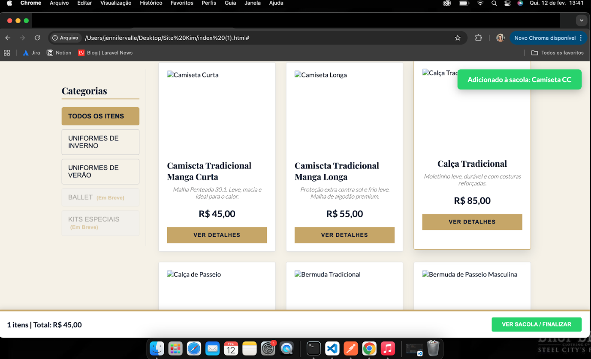

   </td>
  </tr>
</table>

<table>
  <tr>
   <td>ID:
   </td>
   <td>2
   </td>
  </tr>
  <tr>
   <td>Título:
   </td>
   <td>Validar tratamento de entradas inválidas no campo quantidade
   </td>
  </tr>
  <tr>
   <td>Pré Condição:
   </td>
   <td>O usuário deve estar na página de detalhes do produto.
   </td>
  </tr>
  <tr>
   <td>Passos:
   </td>
   <td>
<ol>

<li>Acessar a Loja</li>

<li>Selecionar um produto</li>

<li>Selecionar um tamanho válido</li>

<li>Inserir diferentes valores inválidos no campo quantidade</li>

<li>Clicar em "Adicionar ao carrinho"</li>
</ol>
   </td>
  </tr>
  <tr>
   <td>Resultado Esperado:
   </td>
   <td>O sistema deve permitir apenas números inteiros positivos dentro de um limite definido. Impedir valores decimais. Impedir valores excessivamente altos. Exibir mensagem clara de validação quando a entrada for inválida
   </td>
  </tr>
  <tr>
   <td>Resultado Obtido:
   </td>
   <td>Zero - Sistema não permite adicionar (comportamento correto) \
Negativo - Sistema não permite adicionar (comportamento correto) \
Campo vazio - Sistema impede ação (comportamento correto) \
Decimal - Sistema converte para o primeiro número sem aviso \
Valor extremamente alto - Sistema permite adicionar
   </td>
  </tr>
  <tr>
   <td>Status:
   </td>
   <td>❌Reprovado
   </td>
  </tr>
  <tr>
   <td>Observações:
   </td>
   <td>
   </td>
  </tr>
  <tr>
   <td>Evidências:
   </td>
   <td>
     
     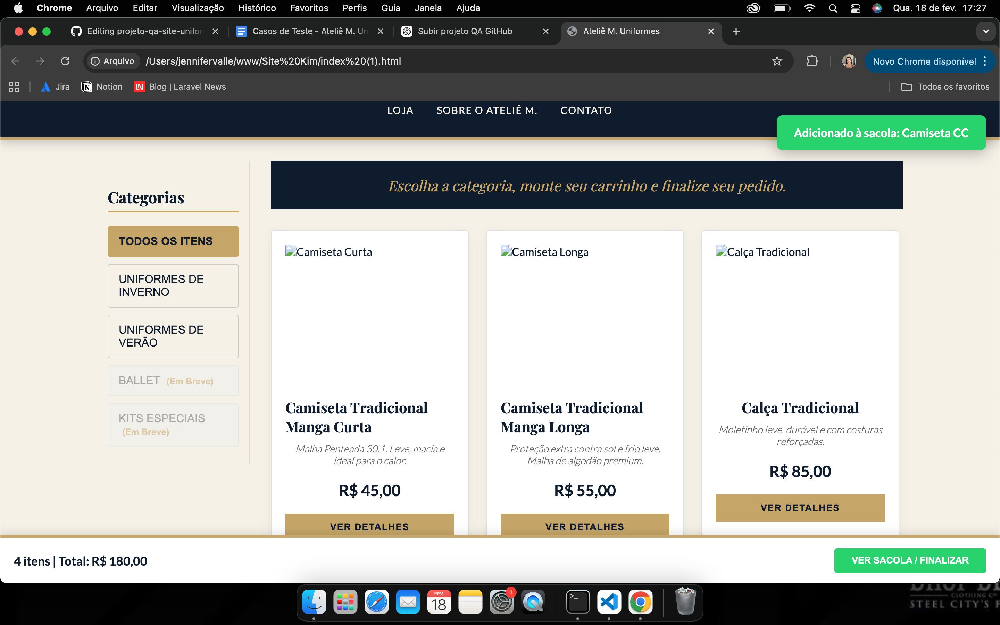
     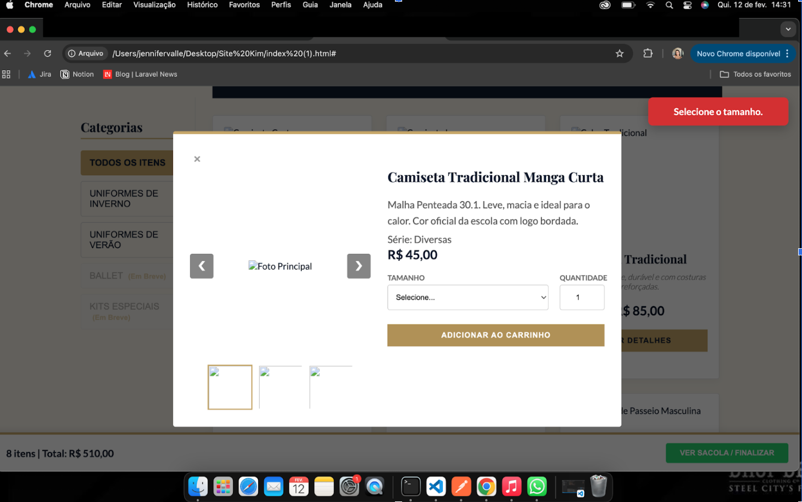
   </td>
  </tr>
</table>

<table>
  <tr>
   <td>ID:
   </td>
   <td>3
   </td>
  </tr>
  <tr>
   <td>Título:
   </td>
   <td>Validar exibição correta do tamanho selecionado no carrinho
   </td>
  </tr>
  <tr>
   <td>Pré Condição:
   </td>
   <td>O usuário deve estar na página de detalhes do produto.
   </td>
  </tr>
  <tr>
   <td>Passos:
   </td>
   <td>
<ol>

<li>Acessar a Loja</li>

<li>Selecionar um produto</li>

<li>Selecionar um tamanho disponível (02,04,06,08,Especial)</li>

<li>Inserir uma quantidade</li>

<li>Clicar em "Adicionar ao carrinho"</li>
</ol>
   </td>
  </tr>
  <tr>
   <td>Resultado Esperado:
   </td>
   <td>O sistema deve adicionar o produto ao carrinho exibindo corretamente o tamanho selecionado.
   </td>
  </tr>
  <tr>
   <td>Resultado Obtido:
   </td>
   <td>O sistema adiciona o produto ao carrinho exibindo corretamente o tamanho selecionado
   </td>
  </tr>
  <tr>
   <td>Status:
   </td>
   <td>✅Aprovado
   </td>
  </tr>
  <tr>
   <td>Observações:
   </td>
   <td>
   </td>
  </tr>
  <tr>
   <td>Evidências:
   </td>
   <td>
     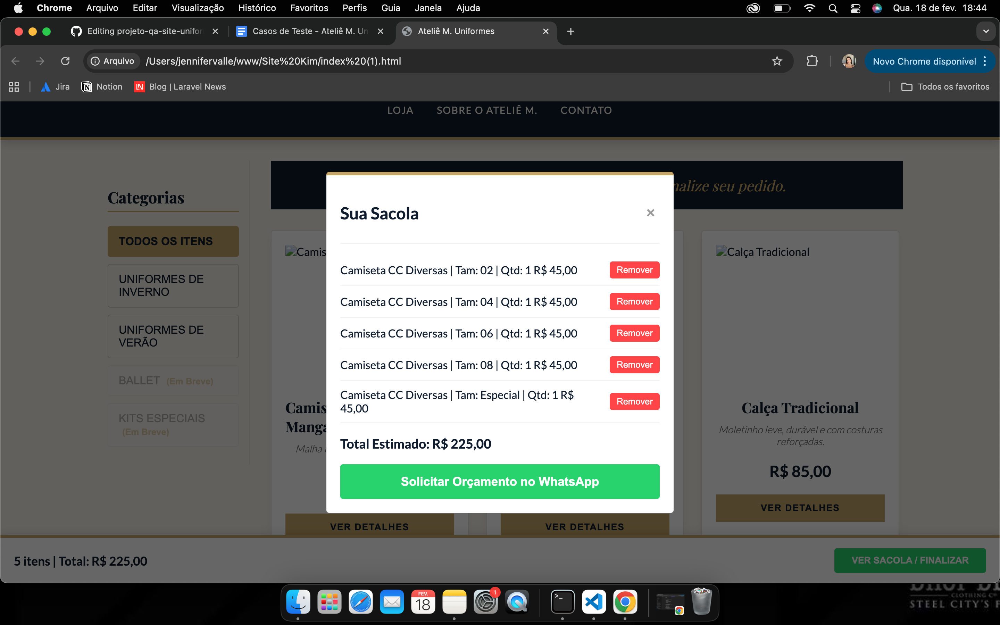
   </td>
  </tr>
</table>

<table>
  <tr>
   <td>ID:
   </td>
   <td>4
   </td>
  </tr>
  <tr>
   <td>Título:
   </td>
   <td>Validar obrigatoriedade de seleção de tamanho antes de adicionar ao carrinho
   </td>
  </tr>
  <tr>
   <td>Pré Condição:
   </td>
   <td>O usuário deve estar na página de detalhes do produto.
   </td>
  </tr>
  <tr>
   <td>Passos:
   </td>
   <td>
<ol>

<li>Acessar a Loja</li>

<li>Selecionar um produto</li>

<li>Não selecionar nenhum tamanho</li>

<li>Clicar em "Adicionar ao carrinho"</li>
</ol>
   </td>
  </tr>
  <tr>
   <td>Resultado Esperado:
   </td>
   <td>O sistema deve impedir a adição do produto ao carrinho e exibir a mensagem: \
 "Selecione o tamanho".
   </td>
  </tr>
  <tr>
   <td>Resultado Obtido:
   </td>
   <td>O sistema impede a adição ao carrinho e exibe a mensagem: \
 "Selecione o tamanho".
   </td>
  </tr>
  <tr>
   <td>Status:
   </td>
   <td>✅Aprovado
   </td>
  </tr>
  <tr>
   <td>Observações:
   </td>
   <td>
   </td>
  </tr>
  <tr>
   <td>Evidências:
   </td>
   <td>
      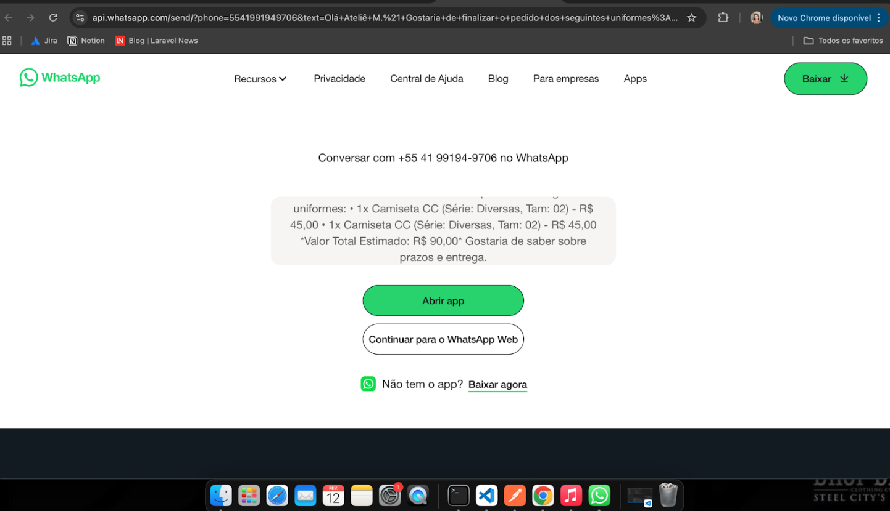
   </td>
  </tr>
</table>

<table>
  <tr>
   <td>ID:
   </td>
   <td>5
   </td>
  </tr>
  <tr>
   <td>Título:
   </td>
   <td>Validar persistência dos itens no carrinho após atualização da página
   </td>
  </tr>
  <tr>
   <td>Pré Condição:
   </td>
   <td>O usuário deve ter adicionado ao menos um produto ao carrinho.
   </td>
  </tr>
  <tr>
   <td>Passos:
   </td>
   <td>
<ol>

<li>Acessar a Loja</li>

<li>Selecionar um produto</li>

<li>Selecionar um tamanho válido</li>

<li>Inserir uma quantidade válida</li>

<li>Clicar em "Adicionar ao carrinho"</li>

<li>Atualizar a página (F5 ou botão atualizar do navegador)</li>
</ol>
   </td>
  </tr>
  <tr>
   <td>Resultado Esperado:
   </td>
   <td>Os itens adicionados ao carrinho devem permanecer salvos após a atualização da página.
   </td>
  </tr>
  <tr>
   <td>Resultado Obtido:
   </td>
   <td>Ao atualizar a página, os itens adicionados ao carrinho são removidos e o estado da página é reiniciado.
   </td>
  </tr>
  <tr>
   <td>Status:
   </td>
   <td>❌Reprovado
   </td>
  </tr>
  <tr>
   <td>Observações:
   </td>
   <td>O sistema não possui mecanismo de persistência (localStorage, sessionStorage ou banco de dados), o que ocasiona perda dos itens ao atualizar a página. Recomenda-se implementar persistência para melhorar a experiência do usuário.
   </td>
  </tr>
  <tr>
   <td>Evidências:
   </td>
   <td>
      
      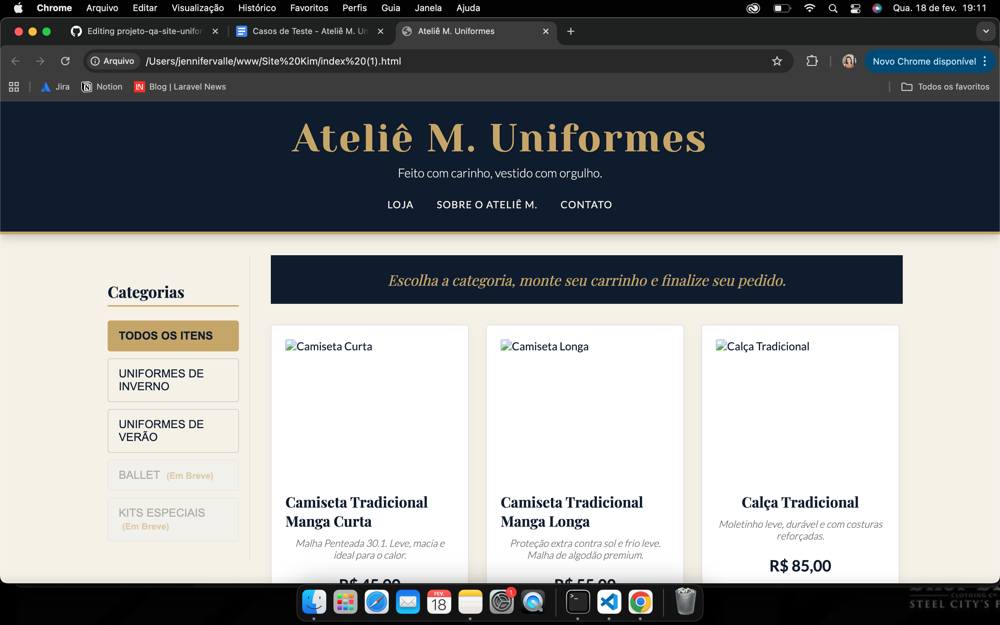
   </td>
  </tr>
</table>

<table>
  <tr>
   <td>ID:
   </td>
   <td>6
   </td>
  </tr>
  <tr>
   <td>Título:
   </td>
   <td>Validar redirecionamento para o WhatsApp ao finalizar pedido
   </td>
  </tr>
  <tr>
   <td>Pré Condição:
   </td>
   <td>O usuário deve ter ao menos um item adicionado ao carrinho.
   </td>
  </tr>
  <tr>
   <td>Passos:
   </td>
   <td>
<ol>

<li>Acessar a Loja</li>

<li>Selecionar um produto</li>

<li>Selecionar um tamanho válido</li>

<li>Inserir uma quantidade válida</li>

<li>Clicar em "Adicionar ao carrinho"</li>

<li>Acessar a sacola / carrinho</li>

<li>Clicar em "Solicitar orçamento no WhatsApp"</li>
</ol>
   </td>
  </tr>
  <tr>
   <td>Resultado Esperado:
   </td>
   <td>O sistema deve redirecionar o usuário para o WhatsApp com a mensagem do pedido preenchida automaticamente.
   </td>
  </tr>
  <tr>
   <td>Resultado Obtido:
   </td>
   <td>O sistema redireciona corretamente o usuário para o WhatsApp com a mensagem do pedido preenchida automaticamente.
   </td>
  </tr>
  <tr>
   <td>Status:
   </td>
   <td>✅Aprovado
   </td>
  </tr>
  <tr>
   <td>Observações:
   </td>
   <td>
   </td>
  </tr>
  <tr>
   <td>Evidências:
   </td>
   <td>
      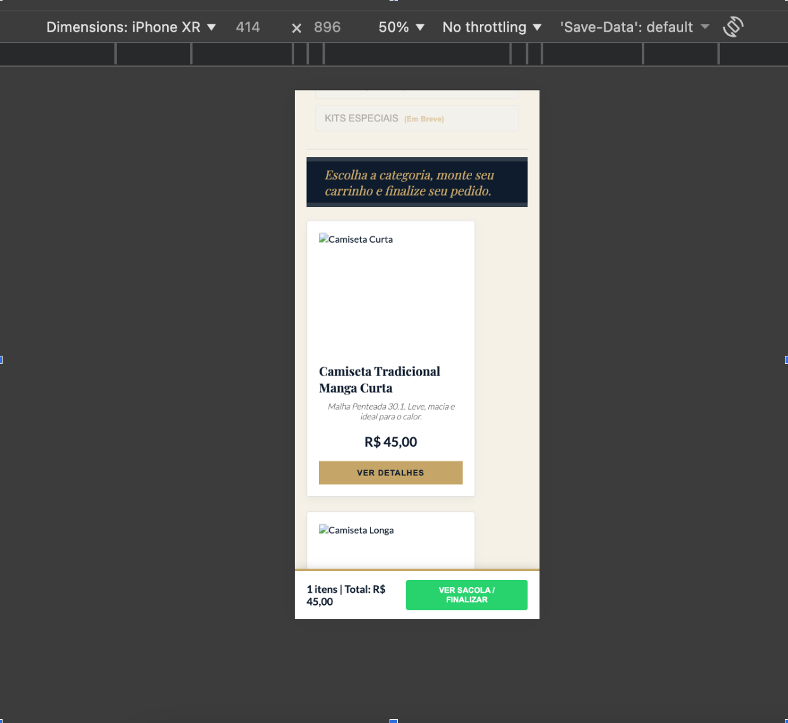
      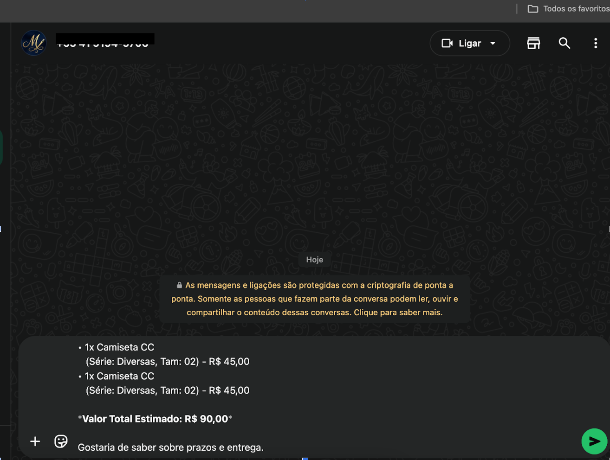
   </td>
  </tr>
</table>

<table>
  <tr>
   <td>ID:
   </td>
   <td>7
   </td>
  </tr>
  <tr>
   <td>Título:
   </td>
   <td>Verificar Layout por outros dispositivos mobile 
   </td>
  </tr>
  <tr>
   <td>Pré Condição:
   </td>
   <td>Usuário acessando o site através de dispositivo mobile (ou modo responsivo no navegador).
   </td>
  </tr>
  <tr>
   <td>Passos:
   </td>
   <td>
<ol>

<li>Acessar o site.</li>

<li>Simular acesso em modo responsivo no navegador (ex:Asus, Iphone XR, Ipad Mini).</li>

<li>Navegar pela página inicial.</li>

<li>Verificar exibição dos tamanhos dos produtos</li>

<li>Verificar alinhamento de botões, imagens e textos.</li>
</ol>
   </td>
  </tr>
  <tr>
   <td>Resultado Esperado:
   </td>
   <td>O layout deve se adaptar corretamente a diferentes resoluções de tela.
   </td>
  </tr>
  <tr>
   <td>Resultado Obtido:
   </td>
   <td>Layout apresenta desorganização visual.
   </td>
  </tr>
  <tr>
   <td>Status:
   </td>
   <td>❌Reprovado
   </td>
  </tr>
  <tr>
   <td>Observações:
   </td>
   <td> Testado em Asus, Iphone XR, Ipad Mini
   </td>
  </tr>
  <tr>
   <td>Evidências:
   </td>
   <td>
      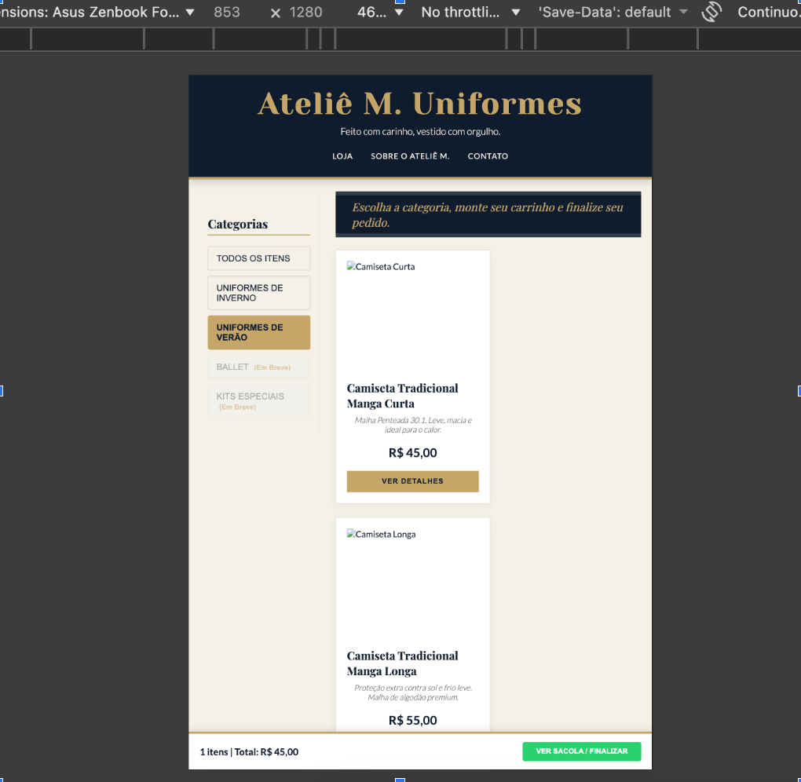
      
      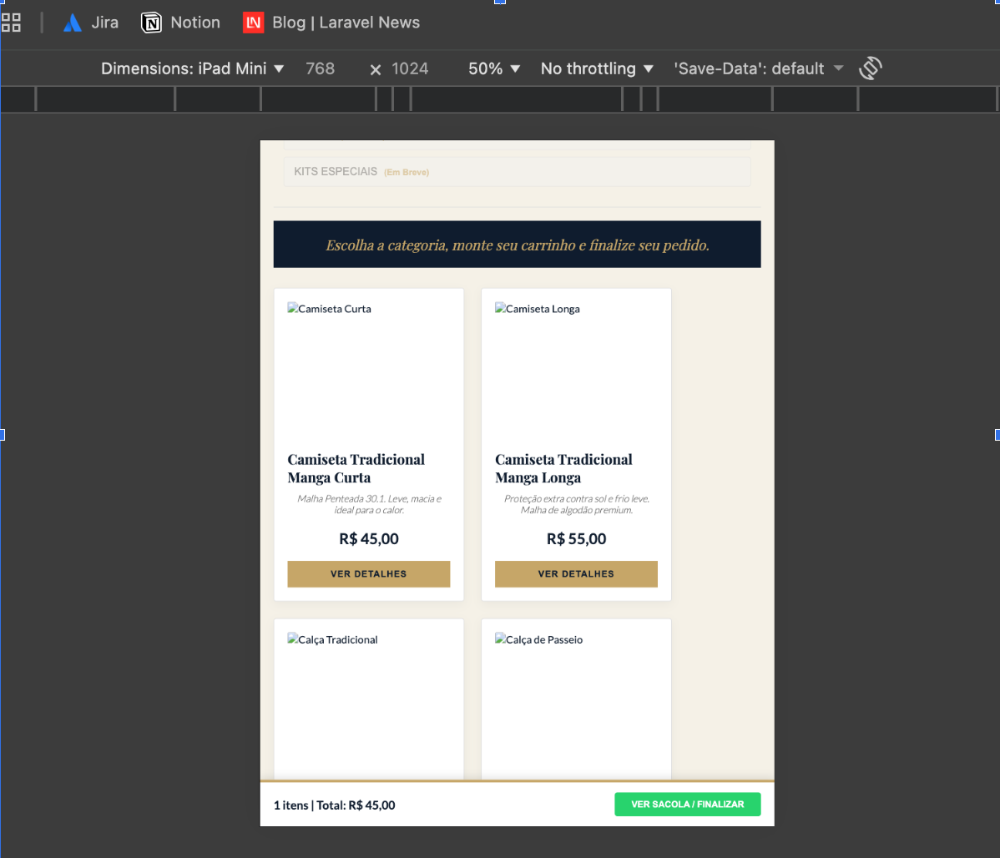
   </td>
  </tr>
</table>

## 💡 Sugestão de Melhoria

Além da elaboração dos casos de teste e cenários BDD, identifiquei uma oportunidade de melhoria na usabilidade do site:

- Adicionar um botão fixo ou link visível para o WhatsApp durante toda a navegação, facilitando o contato direto com a loja.

Essa melhoria visa tornar a experiência do usuário mais simples, acessível e prática.

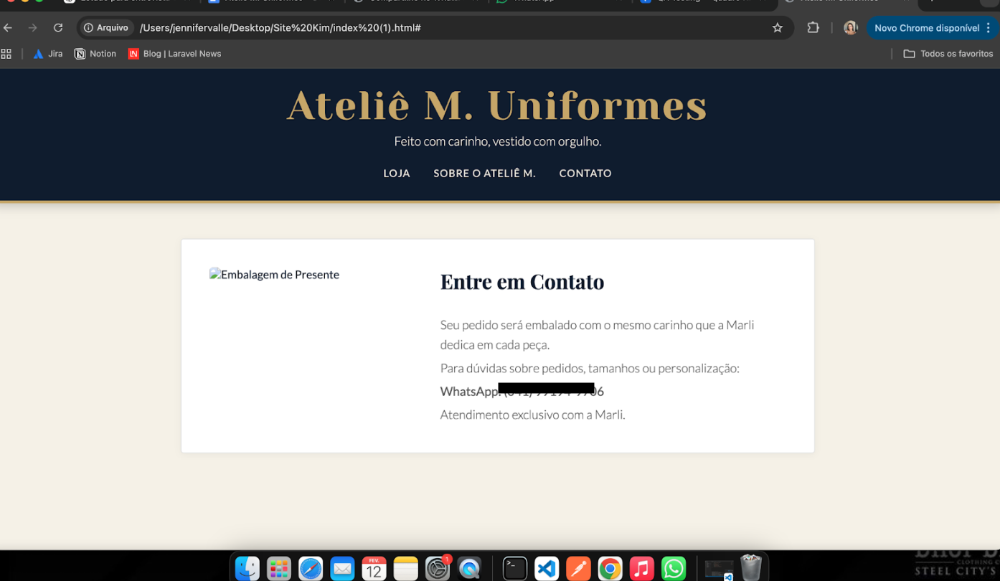
