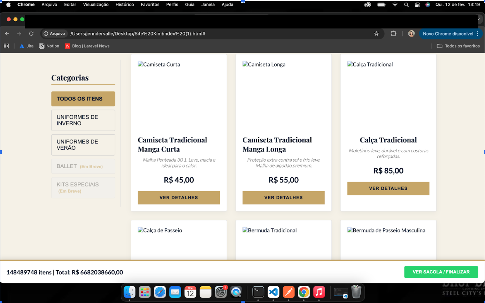

<!-----

You have some errors, warnings, or alerts. If you are using reckless mode, turn it off to see useful information and inline alerts.
* ERRORs: 0
* WARNINGs: 0
* ALERTS: 11

Conversion time: 5.669 seconds.

Using this Markdown file:

1. Paste this output into your source file.
2. See the notes and action items below regarding this conversion run.
3. Check the rendered output (headings, lists, code blocks, tables) for proper
   formatting and use a linkchecker before you publish this page.

Conversion notes:

* Docs™ to Markdown version 2.0β2
* Tue Feb 17 2026 08:31:01 GMT-0800 (Horário Padrão do Pacífico)
* Source doc: Casos de Teste - Ateliê M. Uniformes
* Tables are currently converted to HTML tables.
* This document has images: check for >>>>>  gd2md-html alert:  inline image link in generated source and store images to your server. NOTE: Images in exported zip file from Google Docs may not appear in  the same order as they do in your doc. Please check the images!

----->

>>>>>  gd2md-html alert:  ERRORs: 0; WARNINGs: 0; ALERTS: 11.

<ul style="color: red; font-weight: bold"><li>See top comment block for details on ERRORs and WARNINGs. <li>In the converted Markdown or HTML, search for inline alerts that start with >>>>>  gd2md-html alert:  for specific instances that need correction.</ul>

Links to alert messages:
<a href="#gdcalert1">alert1</a>
<a href="#gdcalert2">alert2</a>
<a href="#gdcalert3">alert3</a>
<a href="#gdcalert4">alert4</a>
<a href="#gdcalert5">alert5</a>
<a href="#gdcalert6">alert6</a>
<a href="#gdcalert7">alert7</a>
<a href="#gdcalert8">alert8</a>
<a href="#gdcalert9">alert9</a>
<a href="#gdcalert10">alert10</a>
<a href="#gdcalert11">alert11</a>

>>>>> PLEASE check and correct alert issues and delete this message and the inline alerts.

<table>
  <tr>
   <td>N
   </td>
   <td>1
   </td>
  </tr>
  <tr>
   <td>Cenário
   </td>
   <td>Validação de quantidades inválidas no carrinho de compras
   </td>
  </tr>
  <tr>
   <td>Passos
   </td>
   <td>Menu inicial > Loja > Ver detalhes > selecionar tamanho > quantidade "<strong>48489748</strong>” ou "2.5” > adicionar ao carrinho
   </td>
  </tr>
  <tr>
   <td>Dado
   </td>
   <td>Que o usuário insira a quantidade inválida no carrinho com números grandes e valores decimais.
   </td>
  </tr>
  <tr>
   <td>Resultado Obtido
   </td>
   <td>❌O sistema aceita a quantidade e adiciona no carrinho.
   </td>
  </tr>
  <tr>
   <td>Resultado Esperado
   </td>
   <td>❌Apresentar valor máximo permitido, não permitir números absurdamente altos, mensagem de erro.
   </td>
  </tr>
  <tr>
   <td>Observação
   </td>
   <td>Adicionar mínimo e máximo.
   </td>
  </tr>
  <tr>
   <td>Evidências
   </td>
   <td>

>>>>>  gd2md-html alert: inline image link here (to images/image1.png). Store image on your image server and adjust path/filename/extension if necessary.  (<a href="#">Back to top</a>)(<a href="#gdcalert2">Next alert</a>) >>>>> 

   </td>
  </tr>
</table>

<table>
  <tr>
   <td>N
   </td>
   <td>2
   </td>
  </tr>
  <tr>
   <td>Cenário
   </td>
   <td>Validação de quantidades válidas no carrinho de compras
   </td>
  </tr>
  <tr>
   <td>Passos
   </td>
   <td>Menu inicial > Loja > Ver detalhes > selecionar tamanho > quantidade "<strong>01</strong>” > adicionar ao carrinho
   </td>
  </tr>
  <tr>
   <td>Dado
   </td>
   <td>Que o usuário insira uma quantidade válida no carrinho “<strong>01".</strong>
   </td>
  </tr>
  <tr>
   <td>Resultado Obtido
   </td>
   <td>✅A quantidade é inserida no carrinho com sucesso
   </td>
  </tr>
  <tr>
   <td>Resultado Esperado
   </td>
   <td>✅A quantidade é inserida no carrinho com sucesso
   </td>
  </tr>
  <tr>
   <td>Observação
   </td>
   <td>
   </td>
  </tr>
  <tr>
   <td>Evidências
   </td>
   <td>

>>>>>  gd2md-html alert: inline image link here (to images/image2.png). Store image on your image server and adjust path/filename/extension if necessary.  (<a href="#">Back to top</a>)(<a href="#gdcalert3">Next alert</a>) >>>>> 

   </td>
  </tr>
</table>

<table>
  <tr>
   <td>N
   </td>
   <td>3
   </td>
  </tr>
  <tr>
   <td>Cenário
   </td>
   <td>Validação de tamanhos
   </td>
  </tr>
  <tr>
   <td>Passos
   </td>
   <td>Menu inicial > Loja > Ver detalhes > selecionar tamanho > adicionar ao carrinho
   </td>
  </tr>
  <tr>
   <td>Dado
   </td>
   <td>Que o usuário escolha um tamanho e adicione o item no carrinho  
   </td>
  </tr>
  <tr>
   <td>Resultado Obtido
   </td>
   <td>✅O tamanho escolhido aparece corretamente no carrinho
   </td>
  </tr>
  <tr>
   <td>Resultado Esperado
   </td>
   <td>✅O tamanho escolhido aparece corretamente no carrinho
   </td>
  </tr>
  <tr>
   <td>Observação
   </td>
   <td>
   </td>
  </tr>
  <tr>
   <td>Evidências
   </td>
   <td>

>>>>>  gd2md-html alert: inline image link here (to images/image3.png). Store image on your image server and adjust path/filename/extension if necessary.  (<a href="#">Back to top</a>)(<a href="#gdcalert4">Next alert</a>) >>>>> 

   </td>
  </tr>
</table>

<table>
  <tr>
   <td>N
   </td>
   <td>4
   </td>
  </tr>
  <tr>
   <td>Cenário
   </td>
   <td>Tentativa de adicionar ao carrinho sem selecionar tamanho
   </td>
  </tr>
  <tr>
   <td>Passos
   </td>
   <td>Menu inicial > Loja > Ver detalhes > nao selecionar tamanho > adicionar ao carrinho
   </td>
  </tr>
  <tr>
   <td>Dado
   </td>
   <td>Que o usuário não selecione um tamanho e adicione o item no carrinho  
   </td>
  </tr>
  <tr>
   <td>Resultado Obtido
   </td>
   <td>✅Mensagem de erro "Selecione o tamanho”
   </td>
  </tr>
  <tr>
   <td>Resultado Esperado
   </td>
   <td>✅Mensagem de erro "Selecione o tamanho”
   </td>
  </tr>
  <tr>
   <td>Observação
   </td>
   <td>
   </td>
  </tr>
  <tr>
   <td>Evidências
   </td>
   <td>

>>>>>  gd2md-html alert: inline image link here (to images/image4.png). Store image on your image server and adjust path/filename/extension if necessary.  (<a href="#">Back to top</a>)(<a href="#gdcalert5">Next alert</a>) >>>>> 

   </td>
  </tr>
</table>

<table>
  <tr>
   <td>N
   </td>
   <td>5
   </td>
  </tr>
  <tr>
   <td>Cenário
   </td>
   <td>Adicionar ao carrinho e atualizar a página
   </td>
  </tr>
  <tr>
   <td>Passos
   </td>
   <td>Menu inicial > Loja > Ver detalhes > selecionar tamanho > quantidade > adicionar ao carrinho > atualizar página
   </td>
  </tr>
  <tr>
   <td>Dado
   </td>
   <td>Que o usuário esteja com itens no carrinho e atualize a página
   </td>
  </tr>
  <tr>
   <td>Resultado Obtido
   </td>
   <td>❌O usuário perde o que havia adicionado no carrinho e reinicia a página
   </td>
  </tr>
  <tr>
   <td>Resultado Esperado
   </td>
   <td>❌A página é atualizada e os itens permanecem no carrinho
   </td>
  </tr>
  <tr>
   <td>Observação
   </td>
   <td>
   </td>
  </tr>
  <tr>
   <td>Evidências
   </td>
   <td>

>>>>>  gd2md-html alert: inline image link here (to images/image5.png). Store image on your image server and adjust path/filename/extension if necessary.  (<a href="#">Back to top</a>)(<a href="#gdcalert6">Next alert</a>) >>>>> 

   </td>
  </tr>
</table>

<table>
  <tr>
   <td>N
   </td>
   <td>6
   </td>
  </tr>
  <tr>
   <td>Cenário
   </td>
   <td>Finalização > Redirecionamento WhatsApp
   </td>
  </tr>
  <tr>
   <td>Passos
   </td>
   <td>Loja > Ver detalhes > selecionar tamanho > quantidade > adicionar ao carrinho > ver sacola/finalizar >Solicitar orçamento no whatsapp
   </td>
  </tr>
  <tr>
   <td>Dado
   </td>
   <td>Que o usuário finalize a compra e solicite o pedido pelo whatsapp
   </td>
  </tr>
  <tr>
   <td>Resultado Obtido
   </td>
   <td>❌O usuário é redirecionado ao whatsapp com a solicitação do pedido
   </td>
  </tr>
  <tr>
   <td>Resultado Esperado
   </td>
   <td>❌O usuário é redirecionado ao whatsapp com a solicitação do pedido
   </td>
  </tr>
  <tr>
   <td>Observação
   </td>
   <td>
   </td>
  </tr>
  <tr>
   <td>Evidências
   </td>
   <td>

>>>>>  gd2md-html alert: inline image link here (to images/image6.png). Store image on your image server and adjust path/filename/extension if necessary.  (<a href="#">Back to top</a>)(<a href="#gdcalert7">Next alert</a>) >>>>> 

>>>>>  gd2md-html alert: inline image link here (to images/image7.png). Store image on your image server and adjust path/filename/extension if necessary.  (<a href="#">Back to top</a>)(<a href="#gdcalert8">Next alert</a>) >>>>> 

   </td>
  </tr>
</table>

<table>
  <tr>
   <td>N
   </td>
   <td>7
   </td>
  </tr>
  <tr>
   <td>Cenário
   </td>
   <td>Verificar Layout por outros dispositivos (mobile)
   </td>
  </tr>
  <tr>
   <td>Passos
   </td>
   <td>Página inicial
   </td>
  </tr>
  <tr>
   <td>Dado
   </td>
   <td>Que o usuário utilize outros dispositivos para acessar o site
   </td>
  </tr>
  <tr>
   <td>Resultado Obtido
   </td>
   <td>❌Os tamanhos não ficam responsivos 
   </td>
  </tr>
  <tr>
   <td>Resultado Esperado
   </td>
   <td>❌Conseguir navegar sem que o layout fique desorganizado
   </td>
  </tr>
  <tr>
   <td>Observação
   </td>
   <td>
   </td>
  </tr>
  <tr>
   <td>Evidências
   </td>
   <td>

>>>>>  gd2md-html alert: inline image link here (to images/image8.png). Store image on your image server and adjust path/filename/extension if necessary.  (<a href="#">Back to top</a>)(<a href="#gdcalert9">Next alert</a>) >>>>> 

>>>>>  gd2md-html alert: inline image link here (to images/image9.png). Store image on your image server and adjust path/filename/extension if necessary.  (<a href="#">Back to top</a>)(<a href="#gdcalert10">Next alert</a>) >>>>> 

>>>>>  gd2md-html alert: inline image link here (to images/image10.png). Store image on your image server and adjust path/filename/extension if necessary.  (<a href="#">Back to top</a>)(<a href="#gdcalert11">Next alert</a>) >>>>> 

   </td>
  </tr>
</table>

____________________________________________________________________________________

>>>>>  gd2md-html alert: inline image link here (to images/image11.png). Store image on your image server and adjust path/filename/extension if necessary.  (<a href="#">Back to top</a>)(<a href="#gdcalert12">Next alert</a>) >>>>> 

Aqui eu adicionaria um link no whatsapp ou botão para redirecionar e facilitar.
